# PopularMovies
You can type in YOUR_API_KEY in se.sugarest.jane.popularmovies.utilities.NetworkUtils . Thank you.

See on Google Play Store : https://play.google.com/store/apps/details?id=se.sugarest.jane.popularmovies

Present users with a grid arrangement of movie posters upon launch. 

Allow users to change sort order via a setting:
The sort order can be by most popular or by highest-rated (movie data fetched from the Internet with the MovieDB API) or by favorite movies (movie data fetched from the local database).

Allow users to choose enabling offline use or not via a setting:
When enabling offline use is checked, movie posters and movies' basic information will be saved to users' local app cache folder for future offline usage, and will be automatically updated approximately every 24 hours. 

Created three tables (Movie, Trailer, Review) in one local database. Implemented Content Provider to access the database to fetch favorite movies data. 

Allow users to tap on a movie poster and transition to a detail screen with additional information such as:
original title / movie poster image thumbnail / a plot synopsis / user rating / release date / trailers / reviews

Allow users to view and play trailers via an Intent either to launch in Youtube app or a web browser (if Youtube app isn't installed on the user's phone).

Allow users to mark a movie as a favorite in the details view by tapping the star floating action button. Allow users to delete a movie from the favorite movie database by tapping the star button again. 

Color grey on the star indicates the movie is not stored in the database. To display the details requires an API request. Color yellow on the star indicates the movie is stored in the database (including trailers and reviews). To display the details does not require an API request.

Implemented sharing functionality to allow the user to share the first trailer's Youtube URL from the movie details screen. 

Allow users to interact with the app via a widget:
When click the widget title, the app main screen opens directly. When click one of the widget movies' list, the clicked movie detail screen opens directly. 
Implemented deep links, so that when users go back from one movie's detail screen, it will come back to the app's main screen instead of jumping out of the app directly. 

Allow users to get a highest-rated popular movie notification every day. 

Incorporated libraries to simplify the amount of code, such as:
Using Picasso to fetch images and load them into views. 
Using RecyclerView and ConstraintLayouts to implement efficient layout design. 

Used adapters and viewholders to populate list views. Used databinding to populate details views. 

Support custom layout-land design to use up white spaces when the phone is rotated to landscape mode. Support different dimensions on Android tablets. 

Support default language: English and another language: Chinese. 

Support accessibility for vision-limited users. 

Stored all the strings in string.xml. Stored all the dimens in dimens.xml. 

# App ScreenShots
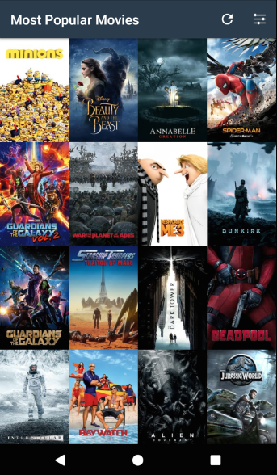 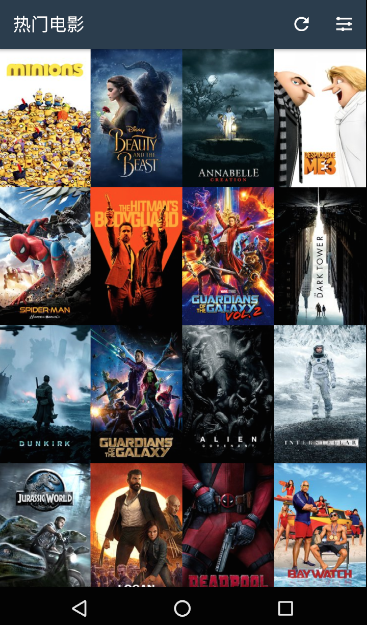 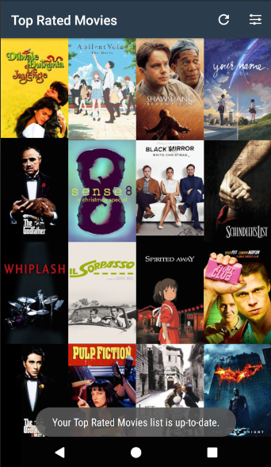 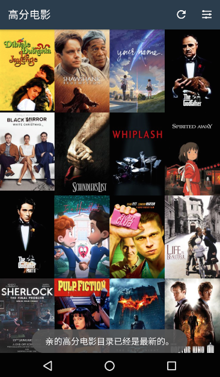 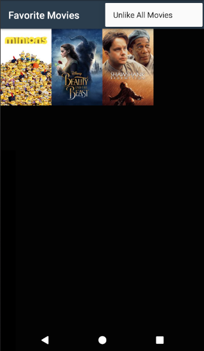 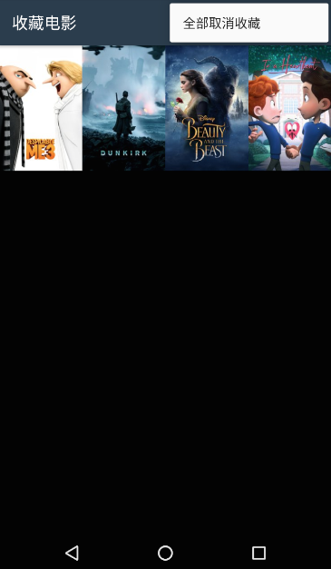 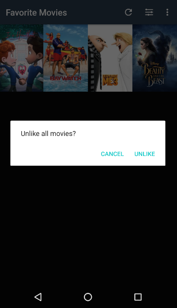 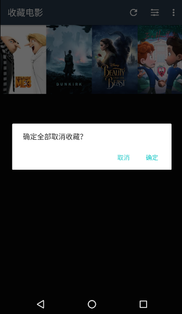 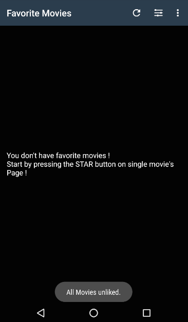  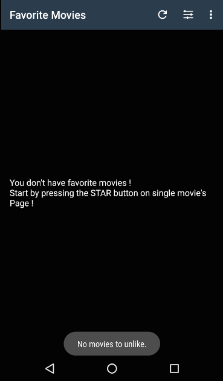 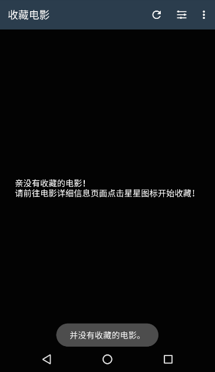 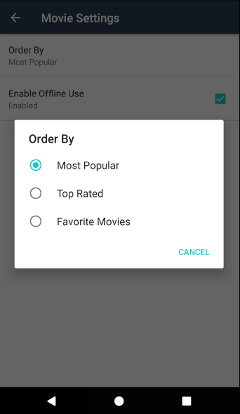 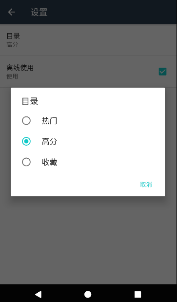 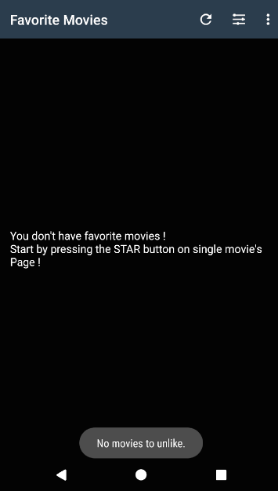 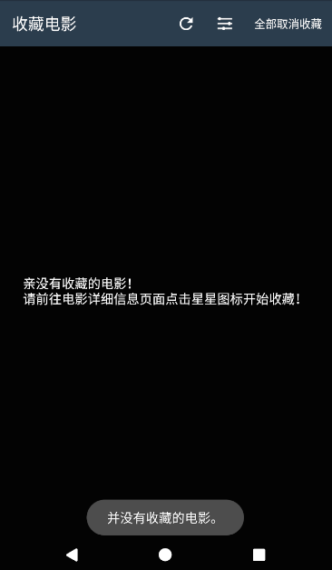 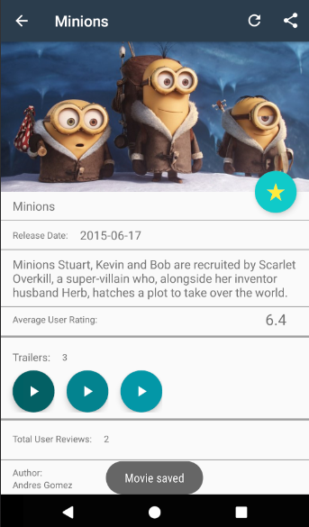 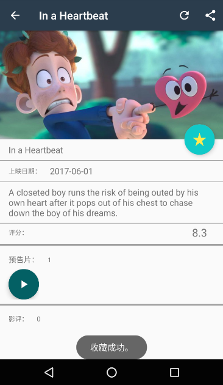 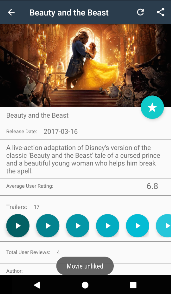 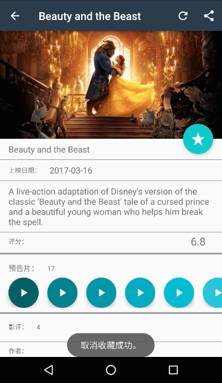 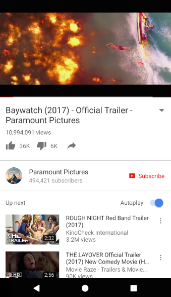 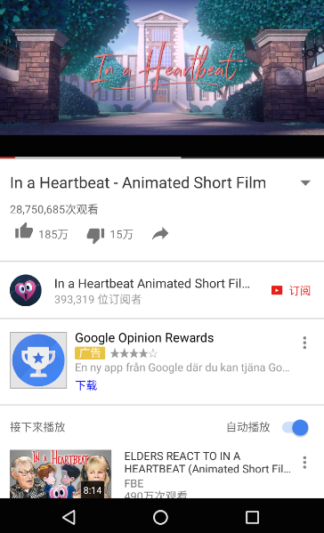 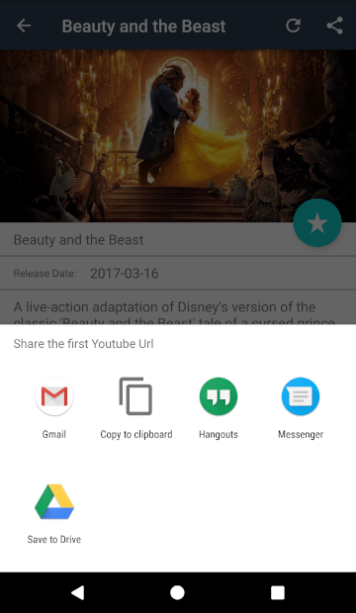  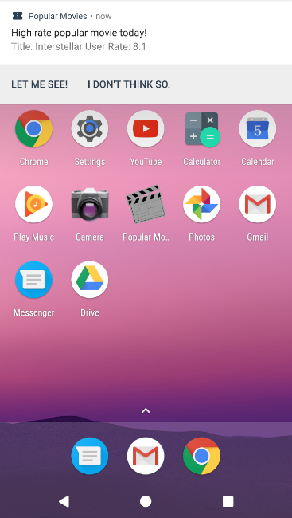 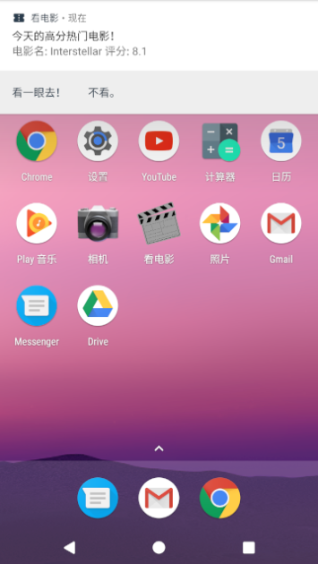 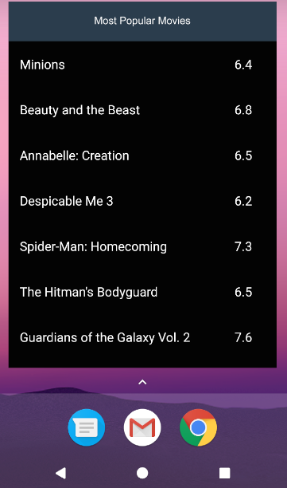 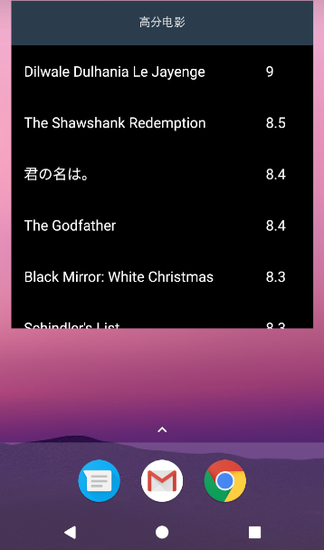 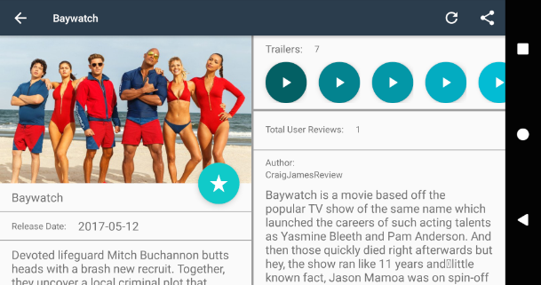 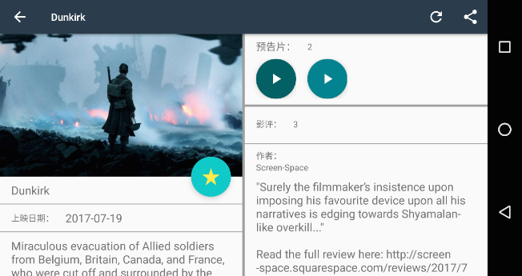

