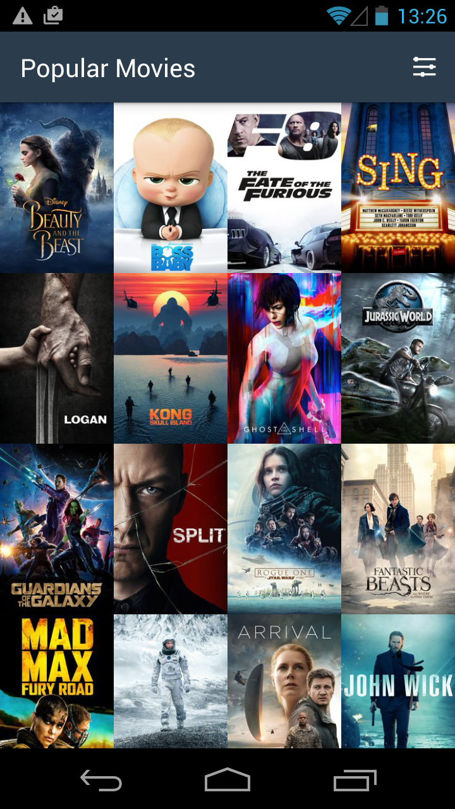

# PopularMovies
-- You can type in YOUR_API_KEY in se.sugarest.jane.popularmovies.utilities.NetworkUtils . Thank you. --

Present the user with a grid arrangement of movie posters upon launch. 

Allow the user to change sort order via a setting:
The sort order can be by most popular or by highest-rated (movie data fetched from the Internet with the MovieDB API) or by favorite movies (movie data fetched from the local database)

Implement three tables (Movie, Trailer, Review) in one local database. Implement Content Provider to access the database to fetch favorite movies data. 

Allow the user to tap on a movie poster and transition to a detail screen with additional information such as:
original title / movie poster image thumbnail / a plot synopsis / user rating / release date / trailers / reviews

Allow the user to view and play trailers via an Intent either to launch in the youtube app or a web browser (if youtube app isn't installed on the user's phone).

Allow the user to mark a movie as a favorite in the details view by tapping the star floating action button. Allow the user to delete a movie from the favorite movie database by tapping the star button again. 

Color grey on the star indicates the movie is not stored in the database. To display the details requires an API request. Color yellow on the star indicates the movie is stored in the database (including trailers and reviews). To display the details does not require an API request.

Implement sharing functionality to allow the user to share the first trailer's Youtube URL from the movie details screen. 

Incorporate libraries to simplify the amount of code, such as:
Using Picasso to fetch images and load them into views. 
Using RecyclerView and ConstraintLayouts to implement efficient layout design. 

Use adapters and viewholders to populate list views. Use databinding to populate details views. 

Support custom layout_land design to use up white spaces when the phone is rotated to landscape mood. Support different dimensions on the Android tablets. 

Store all the strings in string.xml. Store all the dimens in dimens.xml. 

# App ScreenShots

